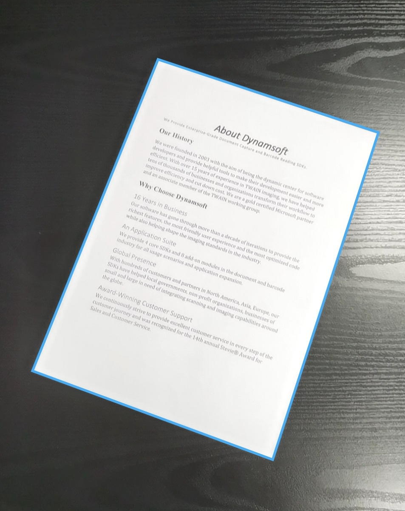
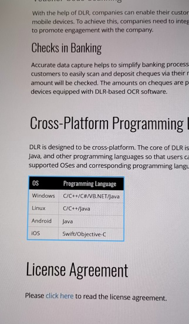
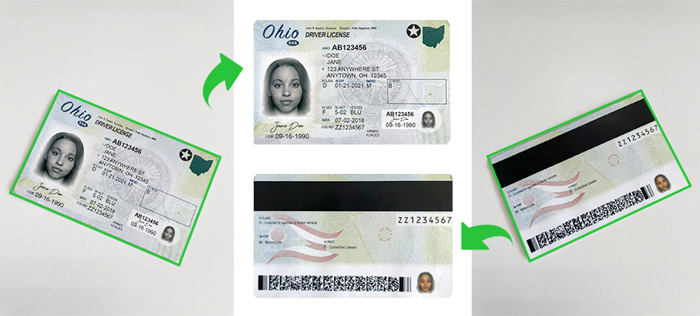
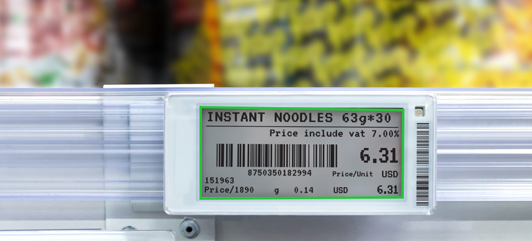

# Introduction to Dynamsoft Document Normalizer

Dynamsoft Document Normalizer (DDN) is an SDK designed to detect quadrilaterals (quads for short) such as document/table boundaries and more from images, then perform document normalization on the images in the detected quads. Document normalization includes a set of functions such as border cropping/deskewing/perspective correction/contrast and brightness adjustment, etc. Additionally, the resulting normalized image can be used for further processing such as Optical Character Recognition (OCR).

DDN powers your software development in the following aspects:

- Robust quadrilateral detection for different structures such as document/table boundaries.
- Various document normalization features such as border cropping/deskewing/perspective correction/output in multiple colour modes/contrast and brightness adjustment, etc.
- Scenario-oriented customizability such as image processing modes

With DDN, you can efficiently embed the functionality of quadrilateral detection and document normalization in your mobile, desktop and server applications. DDN also provides various image processing features, allowing you to customize DDN and meet your business needs.

## Key Features

### Robust quadrilateral detection

With DDN, you can extract the four corner coordinates of one or multiple documents/tables.

<table>
  <tr>
    <td> Figure 1 – Document boundary detection</td>
    <td> Figure 2 – Inner table boundary detection</td>
    <td> Figure 3 – Multiple boundaries detection</td>
  </tr>
</table>

Don't worry if your documents/tables are blurry, damaged, too colorful or peculiar in any way. DDN provides various image processing settings for full customization. Our default settings are sufficient for most cases. However, additional tweaks can be made for your specific cases to achieve greater speed and accuracy.

### Various document normalization features

Do you want to convert a document photo that is randomly taken, to a document image that looks like a carefully scanned document? With DDN, you can easily extract documents from photos and normalize them in various ways.

- Border cropping

Trims the current image, removing the space around the borders.

- Deskew

It is usually used to straighten scanned documents. Deskewing is the process of removing skew by rotating the image by the same degree but in the opposite direction.

- Perspective correction

It is usually used to correct perspective distortion introduced by the camera's perspective relation to the target.

- Output in multiple colour modes

Change the colour space of the output normalized image. DDN supports outputting colour, grayscale and binary images.

   

   
Figure 4 – Original image and output colour/grayscale/binary image

- Brightness and Contrast adjustment

Adjust the brightness and contrast of the output normalized image.

### Scenario-oriented customizability

In order to cope with various scenarios, DDN provides a variety of image processing modes at each stage of the algorithm process to maintain great scalability.

For example, `BinarizationModes` provides several image binarization methods and `RegionPredetectionModes` provides different pre-detection methods to help locate the ROI.

These modes can be configured not only through API but also through a configuration template (as file, string, JSON etc.). Furthermore, the these modes can be customized according to customer scenarios to allow for a more smoother and more seamless performance in the customer's application.

## Usage Scenarios

### Document scanning and archiving

In government or large corporations, paper documents usually need to be digitized and stored in an electronic format. We often do so by taking photos of the documents or scanning the documents. However, the captured document images can potentially not follow the same pattern. You may encounter images taken at different angles, in different lighting levels, blurriness, etc. With DDN, you can normalize or standardize the document images with ease. DDN also provides various settings so you can customize the outcome of the normalized document image to meet your needs.

   

   
Figure 5 – Document scanning and archiving

### Identity Documents

In many scenarios, identity documents such as id card/passport need to be quickly located and identified. However, the captured images of id card/passport might not be uniformed. You may encounter images taken with different angles, lightings, clearness, etc. With DDN, you can detect the boundaries of identity document images and normalize the region of interest (ROI) with ease. Therefore, easing the information extraction process of ID document images.

   

   
Figure 6 – Identity documents

### Retail

In retail, DDN can help detect the price label boundaries in images. Additionally, the extracted images can be used for recognition to extract text information.

   

   
Figure 7 – Price label boundaries

## Mobile Document Capture with DCE

In real life, document capture is often done through mobile devices. In order to simplify the integration cost of camera control, camera preview, interactive editing functions, and more, we recommend that you use `Dynamsoft Camera Enhancer(DCE)` cooperates with DDN to complete mobile document capture. The DCE SDK provides three primary classes:

- **CameraEnhancer**: It provides basic camera control functions as well as advanced features such as video buffering, frame filtering and fast mode for fast camera module integration.

- **DCECameraView**: It is designed to display the camera preview, overlay, scan region, etc.

- **DCEImageEditorView**: It supports previewing still images, displaying graphic items (rectangles, quads, text, etc.) and interactively adjusting the vertices of graphic items.

   

   
Figure 5 – DCECameraView and DCEImageEditorView

