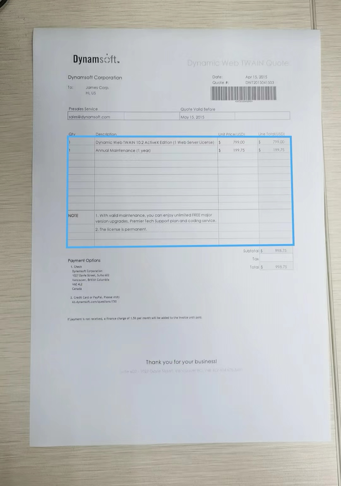
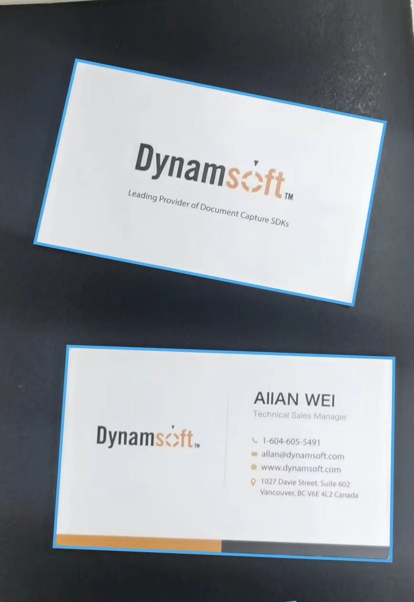

# Overview of Dynamsoft Document Normalizer

Dynamsoft Document Normalizer (DDN) is an SDK designed to detect and extract significant information of document or particular quadrilateral areas. Some common scenarios where a component like DDN can prove handy include price tags in supermarkets, document image in file management, driver licenses, business cards, ID cards, and more.

DDN powers your software development through the following aspects:

- Robust quadrilateral detection for different content such as document/table boundaries.
- Various content normalization features such as border crop/deskew/perspective correction/colur mode/contrast/brightness, etc.
- Scenario-oriented customizablity such as image processing modes

With DDN, you can efficiently embed the functionality of quadrilateral detection and content normalization in multiple platforms. DDN also provides various image processing features, allowing you to customize DDN and meet your business needs.

## Key Features

### Robust quadrilateral detection

With DDN, you can extract the four corner coordinates of one or multiple documents/tables.

- Document boundary detection

   

   
Figure 1 – Document boundary detection

- Table boundary detection

   

   
Figure 2 – Table boundary detection

- Multiple boundaries in one detection

   

   
Figure 3 – Multiple boundaries in one detection

Don’t worry if your documents/tables are blurry, damaged, too colorful or peculiar in any way. DDN provides various image processing settings for fully customization. Our default settings are sufficient for most cases. However, additional tweaks can be made for your specific cases to achieve greater speed and accuracy.

### Various content normalization features

Do you want to convert a document photo that is randomly taken, to a document image that looks like a carefully scanned document? With DDN, you can easily extract documents from photos, and normalize them in various ways.

- Border crop

Trims the current image, removing the space around the borders.

- Deskew

It is usually used to straighten scanned documents. Deskewing is the process of removing skew by rotating the image by the same degree but in the opposite direction.

- Perspective correction

It is usually used to correct perspective distortion introduced by the camera’s perspective relation to the target.

- Colour mode

Change the colour space of the output normalized image. DDN supports outputting colour, grayscale and binary images.

   

   
Figure 4 – Original image and output colour/grayscale/binary image

- Brightness and Contrast

Adjust the brightness and contrast of the output normalized image.

### Scenario-oriented customizablity

In order to cope with various scenarios, DDN provides a variety of image processing modes at each stage of the algorithm process to maintain great scalability.

For example, [`BinarizationModes`]({{site.parameters_reference }}binarization-modes.html) provides several image binarization methods and [`RegionPredetectionModes`]({{site.parameters_reference }}region-predetection-modes.html) provides different pre-detection methods to help locate the ROI.

These modes can be configured not only through API but also through a configuration template (as file, string, JSON etc.). Furthermore, the implementation of these modes can be customized according to customer scenarios to seamlessly integrated with customer's project.

## Usage scenarios

### Retail

In retail, DDN can help detect the price label boundaries or table boundaries in images. Additionally, the extracted images can be used for OCR engine recognition to extract text information.

### Identity Documents

In many scenarios, identity documents such as id card/passport need to be quickly located and identified. However, the captured images of id card/passport might not be uniformed. You may encounter images taken with different angles, lightings, clearness…etc. With DDN, you can detect the the boundaries of identity document images and normalize the ROI with ease. Therefore, the information extraction of ID document images will become easier.

### Document scanning and archiving

In government or large corporations, we want to keep an electronic version of paper documents. We often do so by taking photos or scanning of the documents. However, the captured document images might not be uniformed. You may encounter images taken with different angles, lightings, clearness…etc. With DDN, you can normalize the document images with ease. DDN also provide various settings so you can customize the outcome of the normalized document image to meet your needs.

## Cross-Platform Programming Languages

DDN is designed to be cross-platform. The core of DDN is written in C/C++ for performance. The library is wrapped for Java, Objective-C and other programming languages so that users can use DDN on iOS, Android, Windows, and Linux. Below is a list of supported OSes and corresponding programming languages:

| OS            | Programming Language |
|---------------|----------------------|
|Windows        | C/C++                |
|Linux          | C/C++                |
|Android        | Java                 |
|iOS            | Swift/Objective-C    |
