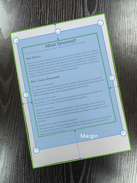

# LineExtractionModes

`LineExtractionModes` specifies the algorithm used to extract lines.

It consists of one or both of the following modes, with each mode representing a different way to extract lines.

## Candidate Mode List

- LEM_GENERAL
- LEM_MARGIN_BASED

### LEM_GENERAL

Extracts lines using the general algorithm.

### LEM_MARGIN_BASED

Extracts lines based on the margin between the document content and the document border. Once the margin is found, the location of the document border is then calculated.

<div align="center">
   <p></p>
   <p>Extracts Lines Based on Margin</p>
</div>

## Setting Methods

### As JSON Parameter

`LineExtractionModes` as a JSON parameter is a JSON Object array defined as below.

| Parent Json Object | Key Name | Key Value |
| ------------------ | ------------------- | ---------- |
| ImageParameter | LineExtractionModes | A JSON Object array while each Object is defined as below |

| Key Name | Key Value | Description |
| -------- | --------- | ----------- |
| Mode | Any one in Candidate Mode List as string | (Required) Specifies a mode for line extraction.  |

**Default Value**

```json
{
    "LineExtractionModes": [
        {
            "Mode": "LEM_GENERAL" 
        }
    ]
}
```

**JSON Parameter Example**

```json
{
    "LineExtractionModes": [
        {
            "Mode": "LEM_GENERAL"
        },
        {
            "Mode": "LEM_MARGIN_BASED" 
        }
    ]
}
```
