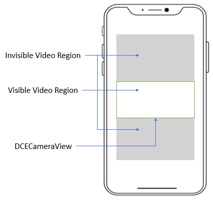

# DCECameraView Class

The camera view is the main UI view of the DCE SDK. It is designed to display the video preview, overlay, viewfinder, etc.

```java
class com.dynamsoft.dce.DCECameraView
```

| Method Name | Description |
|------|------|
| [`DCECameraView`](#dcecameraview) | Initialize the `DCECameraView` object. |
| [`setTorchButton`](#settorchbutton) | Set the position, size and image of the torch button. |
| [`setTorchButtonVisible`](#settorchbuttonvisible) | Set the visibility of the torch button. The torch button icon is pre-set in the SDK. |
| [`getTorchButtonVisible`](#gettorchbuttonvisible) | Get the visibility setting of the torch button. When it returns true, a torch button should be displayed on the screen. |
| [`getDrawingLayer`](#getdrawinglayer) | Get the [`DCEDrawingLayer`](dcedrawinglayer.md) instance with the layer ID. |
| [`createDrawingLayer`](#createdrawinglayer) | Create a user-defined [`DCEDrawingLayer`](dcedrawinglayer.md) instance. |
| [`getVisibleRegionOfVideo`](#getvisibleregionofvideo) | Get the visible region of the video streaming. |
| [`setOverlayVisible`](#setoverlayvisible) | **Deprecated**. This method controls whether the camera view to display coloured and translucent overlay. |
| [`getOverlayVisible`](#getoverlayvisible) | **Deprecated**. Get the visibility (true: visible/ false: invisible) of the overlay. |
| [`setOverlayColour`](#setoverlaycolour) | **Deprecated**. Set the stroke and fill colour of the overlay. |
| [`setViewfinderVisible`](#setviewfindervisible) | **Deprecated**. This method controls whether to display a viewfinder. |
| [`getViewfinderVisible`](#getviewfindervisible) | **Deprecated**. Get the visibility (true: visible/ false: invisible) of the viewfinder. |
| [`setViewfinder`](#setviewfinder) | **Deprecated**. Set the position and the size of the viewfinder. |

&nbsp;

## DCECameraView

Initialize the `DCECameraView` object.

```java
DCECameraView(android.content.Context context)
```

**Parameters**

`context`: An instance of global information about an application environment.

&nbsp;

## setTorchButton

Set the styles of the button with the position, size and images.

```java
void setTorchButton(Point torchButtonPosition, int width, int height, Drawable torchOnImage, Drawable torchOffImage)
```

**Parameters**

`torchButtonPosition`: The coordinate of the top-left corner of the torch button. You can input a null value to apply no changes to the position of the torch button.  
`width`: The width of the torch button. You can input a null value to apply no changes to the width of the torch button.  
`height`: The height of the torch button. You can input a null value to apply no changes to the height of the torch button.  
`torchOnImage`: Display this image when the torch is on. You can input a null value to apply no changes to the image of the torch button when the torch is on.  
`torchOffImage`: Display this image when the torch is off. You can input a null value to apply no changes to the image of the torch button when the torch is off.

**Code Snippet**

```java
cameraView.setTorchButton(new Point(100,100), 50,50, getDrawable(R.drawable.torch_on_image), getDrawable(R.drawable.torch_off_image));
```

**Remarks**

Method `setTorchButton(Point torchButtonPosition)` is deprecated. Please use the new `setTorchButton` method.

&nbsp;

## setTorchButtonVisible

Set the visibility of the torch button. The torch button icon is preset in the SDK. If the `torchButtonPosition` has never been configured, the `torchButton` will be displayed on the default position. Currently, the icon and the size of the button are not available for setting.

```java
void setTorchButtonVisible(boolean isTorchButtonVisible)
```

**Parameters**

`isTorchButtonVisible`: When the value is true, the torch button should be displayed. Otherwise, the torch button should be hidden.

**Code Snippet**

```java
dceCameraView.setTorchButtonVisible(true);
```

&nbsp;

## getTorchButtonVisible

Get the visibility setting of the torch button. When it returns true, a torch button should be displayed on the screen.

```java
Boolean getTorchButtonVisible()
```

**Return Value**

A boolean value. When the value is true, the torch button should be displayed. Otherwise, the torch button should be hidden.

**Code Snippet**

```java
Boolean isTorchButtonVisible = dceCameraView.getTorchButtonVisible();
```

&nbsp;

## getDrawingLayer

Get the [`DCEDrawingLayer`](dcedrawinglayer.md) instance with the layer ID.

```java
public DCEDrawingLayer getDrawingLayer(int id);
```

**Parameters**

`id`: The id of the target [`DCEDrawingLayer`](dcedrawinglayer.md).

**Parameters**

`id`: The id of the `DrawingLayer`.

**Available ID List**

| Layer | ID |
| ----- | -- |
| DDN_LAYER_ID | 1 |
| DBR_LAYER_ID | 2 |
| DLR_LAYER_ID | 3 |
| USER_DEFINED_LAYER_BASE_ID | 100 |

**Code Snippet**

```java
DCEDrawingLayer layer = dceCameraView.getDrawingLayer(DCEDrawingLayer.DDN_LAYER_ID);
```

&nbsp;

## createDrawingLayer

Create a user-defined [`DCEDrawingLayer`](dcedrawinglayer.md) instance.

```java
public DCEDrawingLayer createDrawingLayer();
```

**Return Value**

An instance of [`DCEDrawingLayer`](dcedrawinglayer.md).

**Code Snippet**

```java
DCEDrawingLayer layer = dceCameraView.createDrawingLayer();
```

## setOverlayVisible

> The method is deprecated

This method controls whether the camera view displays coloured and translucent overlays.

```java
void setOverlayVisible(boolean overlayVisibile)
```

**Parameters**

`overlayVisibile`: If true, the camera view will draw and display overlays according to the position and colour settings. Otherwise, the overlay will be hidden.

**Code Snippet**

```java
//Suppose dceCameraView is an object of `DCECameraView`
dceCameraView.setOverlayVisible(true);
```

&nbsp;

## getOverlayVisible

> The method is deprecated

Get the visibility (true: visible/ false: invisible) of the overlay.

```java
boolean getOverlayVisible()
```

**Return Value**

The visibility (true: visible/ false: invisible) of the overlay.

**Code Snippet**

```java
//Suppose dceCameraView is an object of `DCECameraView`
boolean isVisible = dceCameraView.getOverlayVisible();
```

&nbsp;

## setOverlayColour

> The method is deprecated

Set the stroke and fill colour of the overlays.

```java
void setOverlayColour(int strokeARGB, int fillARGB)
```

**Parameters**

`strokeARGB`: The colour code of the overlays stroke.
`fillARGB`: The colour code of the overlays stroke.

**Code Snippet**

```java
//Suppose dceCameraView is an object of `DCECameraView`
dceCameraView.setOverlayColour(0xff00ff00, 0x00000000);
```

&nbsp;

## setViewfinderVisible

> The method is deprecated

This method controls whether to display a viewfinder.

```java
void setViewfinderVisible(boolean viewfinderVisible)
```

**Parameters**

`viewfinderVisible`: A boolean value that means whether the viewfinder is visible or not. Users can define the position and size of the viewfinder via method [`setViewfinder`](#setviewfinder). The viewfinder will be created based on the default value if the `setViewfinder` has never been triggered.

**Code Snippet**

```java
//Suppose dceCameraView is an object of `DCECameraView`
dceCameraView.setViewfinderVisible(true);
```

&nbsp;

## getViewfinderVisible

> The method is deprecated

Get the visibility (true: visible/ false: invisible) of the viewfinder.

```java
boolean getViewfinderVisible()
```

**Return Value**

A boolean value means whether the viewfinder is visible.

**Code Snippet**

```java
//Suppose dceCameraView is an object of `DCECameraView`
boolean flag = dceCameraView.getViewfinderVisible();
```

&nbsp;

## setViewfinder

> The method is deprecated

Set the position and the size of the viewfinder.

```java
void setViewfinder(float left, float top, float right, float bottom) throws CameraEnhancerException
```

**Parameters**

`left`: The distance (by percentage) between the left border of the viewfinder and the left side of the screen. The default value is 0.15.  
`top`: The distance (by percentage) between the top border of the viewfinder and the top side of the screen. The default value is 0.3.  
`right`: The distance (by percentage) between the right border of the viewfinder and the left side of the screen. The default value is 0.85.  
`bottom`: The distance (by percentage) between the bottom border of the viewfinder and the top side of the screen. The default value is 0.7.

**Code Snippet**

```java
//Suppose dceCameraView is an object of `DCECameraView`
dceCameraView.setViewfinder(0.2, 0.3, 0.8, 0.7);
```

**Remarks**

The viewfinder is built based on the screen coordinate system. The origin of the coordinate is the left-top point of the mobile device. The `left border` of the viewfinder always means the closest border that parallels to the left side of the mobile device no matter how the mobile device is rotated.

&nbsp;

## getVisibleRegionOfVideo

Get the visible region of the video streaming.

When the shape of your camera view is quite different from the shape of the video streaming, there might exist a large area that is invisible. You can use this method to get the region of this invisible area.

<div align="center">
    <p></p>
    <p>What's Visible Region</p>
</div>

**Return Value**

An `iRegionDefinition` object. You can use this object to set the scan region so that the invisible areas will be cropped from the video frames.

**Code Snippet**

```java
iRegionDefinition visibleRegion = cameraView.getVisibleRegion();
cameraEnhancer.setScanRegion(visibleRegion);
```
