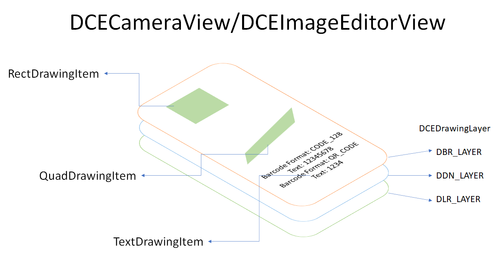

# UI Configurations

# UI Configurations Classes

| Class | Description |
| ----- | ----------- |
| [`DCECameraView`](dcecameraview.md) | The view displays video streaming and auxiliary UI elements. |
| [`DCEImageEditorView`](dceimageeditorview.md) | The view displays still image and auxiliary UI elements. |

`DCECameraView` and `DCEImageEditorView` are the main classes for user to configure the UI. `DrawingItems` are the UI elements that user can create, modify and interact on the UI view. All the `DrawingItems` are contained in `DCEDrawingLayers` and finally displayed on the `DCECameraView` or `DCEImageEditorView`.

<div align="center">
    <p></p>
    <p>DrawingItems in DCECameraView and DCEImageEditorView</p>
</div>

## Basic Usages

&nbsp;

### Display Highlight Overlays

When `DynamsoftCameraEnhancer(DCE)` is used together with other Dynamsoft products like `DynamsoftBarcodeReader(DBR)` and `DynamsoftDocumentNormalizer(DDN)`, it can automatically draw highlight overlays (`QuadDrawingItem`) on the detected barcodes or documents. If you want to disable this feature, you can use the following code to stop drawing the highlights.

```java
// Example: Remove all highlights on the barcodes
editorView.getDrawingLayer(DCEDrawingLayer.DBR_LAYER_ID).setVisible(false);
```

&nbsp;

### Style Configuration

You can change the style of the `DrawingItems` specifying a `DrawingStyleId`. The `DrawingStyleId` can be a preset `DrawingStyle` or a user-defined `DrawingStyle`.

To change the style of `DrawingItems` with preset `DrawingStyles`:

```java
// You can change the drawing style of all DrawingItems in the layer.
cameraView.getDrawingLayer(DCEDrawingLayer.DBR_LAYER_ID).setDrawingStyleId(DrawingStyleManager.STYLE_ORANGE_STROKE);
// You can also change the drawing style of a part of the DrawingItems.
editorView.getDrawingLayer(DCEDrawingLayer.DBR_LAYER_ID).setDrawingStyleId(DrawingStyleManager.STYLE_ORANGE_STROKE, EnumDrawingItemState.DIS_SELECTED, EnumDrawingItemMediaType.DIMT_QUADRILATERAL);
```

List of all available preset styles:

```java
// DrawingItems on DDN layer are using this style as default.
public static int STYLE_BLUE_STROKE = 1;
// DrawingItems on DBR layer are using this style as default.
public static int STYLE_GREEN_STROKE = 2;
// DrawingItems on DLR layer are using this style as default.
public static int STYLE_ORANGE_STROKE = 3;
// DrawingItems on user defined layer are using this style as default.
public static int STYLE_YELLOW_STROKE = 4;
// DrawingItems on DDN layer are using this style as default if they are selected.
public static int STYLE_BLUE_STROKE_FILL = 5;
// DrawingItems on DBR layer are using this style as default if they are selected.
public static int STYLE_GREEN_STROKE_FILL = 6;
// DrawingItems on DLR layer are using this style as default if they are selected.
public static int STYLE_ORANGE_STROKE_FILL = 7;
// DrawingItems on user defined layer are using this style as default if they are selected.
public static int STYLE_YELLOW_STROKE_FILL = 8;
```

<div align="center">
    <p></p>
    <p>Preset DrawingStyles</p>
</div>

If you want to set other styles to your UI elements, you can add your personal defined `DrawingStyles`.

```java
// Create a new DrawingStyle via DrawingStyle manager and get the style ID of the new style.
int myStyleId = DrawingStyleManager.createDrawingStyle(0xff00ff00,2,0xff00ff00,0xff00ff00,12,"sans-serif");
// Assign the newly created style to the targeting DrawingItems.
cameraView.getDrawingLayer(DCEDrawingLayer.DBR_LAYER_ID).setDrawingStyleId(myStyleId);
```

To modify the existing DrawingStyles:

```java
// Get the style by ID.
DrawingStyle myStyle = DrawingStyleManager.getDrawingStyle(myStyleId);
// Modify the style.
myStyle.strokeColor = 0xff00ff00;
```

&nbsp;

## Advanced Usages

&nbsp;

### Add User Defined UI Elements

Apart from the system-defined items, you can add your personal defined UI elements via the `DrawingItem` APIs. On this page, we will draw a user-defined `quadrilateral` on the `DCEImageEditorView` for example.

1. Create a new `QuadDrawingItem`.

   ```java
   // Create a new quadrilateral.
   com.dynamsoft.core.Quadrilateral newQuad = new Quadrilateral();
   // Add your code to assign the quad data.
   newQuad.points = new com.dynamsoft.core.Point[]{new Point(0,0),new Point(100,0), new Point(100,100), new Point(0,100)};
   // Use the newly created quadrilateral to initialize the DrawingItem.
   DrawingItem item = new QuadDrawingItem(newQuad);
   ```

2. Add the Created `DrawingItems` to the view.

   ```java
   // To display the drawingItems on the UI, you have to put the DrawingItems in a ArrayList.
   ArrayList<DrawingItem> drawingItems = new ArrayList<>();
   drawingItems.add(item);
   // The following code shows how to add the ArrayList of DrawingItems to the first layer of the cameraView.
   // There are multiple layers in DCECameraView and DCEImageEditorView.
   // You must select a layer for your DrawingItems.
   cameraView.getDrawingLayer(DCEDrawingLayer.DDN_LAYER_ID).addDrawingItems(drawingItems);
   // To add the DrawingItems to the imageEditorView
   // imageEditorView.getDrawingLayer(DCEDrawingLayer.DDN_LAYER_ID).addDrawingItems(drawingItems);
   ```

&nbsp;
