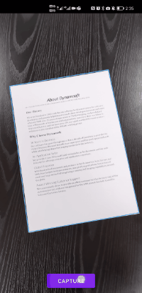

# Camera Enhancer API Reference

`DynamsoftCameraEnhancer` is the libary that provides camera control and UI configuration APIs.

## Components

**Main Class**

| Classes | Description |
| ------- | ----------- |
| [`DynamsoftCameraEnhancer`](camera-enhancer.md) | The main class that includes camera control APIs. Features like frame filtering can be enabled via this class. |

**UI Classes**

| Classes | Description |
| ------- | ----------- |
| [`DCECameraView`](dcecameraview.md) | UI view class that displays video streaming. UI configuration APIs are available for users to visualize the detected results on the video streaming. |
| [`DCEImageEditorView`](dceimageeditorview.md) | UI view class that displays images. UI configuration APIs are available for users to highlight the detected results on the view with quadrilateral elements. The border of the quadrilaterals can be edited so that user can further accurate the detected results. |

    

    
DynamsoftCameraEnhancer UI View

**Auxiliary Classes**

| Classes | Description |
| ------- | ----------- |
| [`DCEFrame`](dceframe.md) | The struct that `DynamsoftCameraEnhancer` stores the video frames. It contains the image data and other information of the video frame. |
| [`DCEDrawingLayer`](dcedrawinglayer.md) | The layers that contains `DrawingItems`. Users can add configurations for the `DrawingItems` via `DCEDrawingLayer` |
| [`DrawingItem`](drawingitem.md) | The`DrawingItems` are elements that can be added the UI. |
| [`QuadDrawingItem`](drawingitem-quad.md) | A subclass of `DrawingItem`. Users can add `QuadDrawingItems` to the layer to display quadrilateral elements on the view. |
| [`RectDrawingItem`](drawingitem-rect.md) | A subclass of `DrawingItem`. Users can add `RectDrawingItems` to the layer to display rectangle elements on the view. |
| [`TextDrawingItem`](drawingitem-text.md) | A subclass of `DrawingItem`. Users can add `TextDrawingItems` to the layer to display text box on the view. |
| [`DrawingStyle`](drawingstyle.md) | `DrawingStyle` stores colour, font and other detailed styles of `DrawingItems`. |
| [`DrawingStyleManager`](drawingstylemanager.md) | The class for users to create and adjust `DrawingStyles`. |
| [`CameraEnhancerException`](camera-enhancer-exception.md) | Exception for signaling camera enhancer errors. |

**Interface**

| Classes | Description |
| ------- | ----------- |
| [`DCEFrameListener`](interface-dceframelistener.md) | The interface to handle callback when previewed frame callback is returned. |
| [`DCECameraStateListener`](interface-dcecamerastatelistener.md) | The interface to handle callback when camera state changes. |
