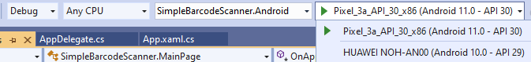

# Dynamsoft Document Normalizer - Xamarin.Forms User Guide

## Table of Contents

- [System Requirements](#system-requirements)
- [Installation](#installation)
- [Build Your First Application](#build-your-first-application)
  - [Set up Development Environment](#set-up-development-environment)
  - [Initialize the Project](#initialize-the-project)
  - [Include the Library](#include-the-library)
  - [Initialize IDocumentNormalizer and ICameraEnhancer](#initialize-idocumentnormalizer-and-icameraenhancer)
  - [MainPage for Realtime Quadrilateral Detection](#mainpage-for-realtime-quadrilateral-detection)
  - [QuadEditorPage for Interactive Editing of Quads](#quadeditorpage-for-interactive-editing-of-quads)
  - [ResultPage for Displaying the Normalized Image](#resultpage-for-displaying-the-normalized-image)
  - [Add Camera Permission](#add-camera-permission)
  - [Run the Project](#run-the-project)

## System Requirements

**Xamarin**

- NETStandard.Library 2.0+
- Xamarin.Forms 5.0.0.2515+
- Xamarin.Essentials: 1.3.1+ (1.4.0+ Recommended)

**Android**

- Supported OS: **Android 5.0** (API Level 21) or higher.
- Supported ABI: **armeabi-v7a**, **arm64-v8a**, **x86** and **x86_64**.
- Development Environment: Android Studio 3.4+ (Android Studio 4.2+ recommended).
- JDK: 1.8+
- Compile using Android version (Target Framework): Android 12.0(s) or higher.

**iOS**

- Supported OS: **iOS 9.0** or higher.
- Supported ABI: **arm64** and **x86_64**.
- Development Environment: Xcode 10 and above.

## Installation

Open the **Nuget Package Manager** of your project, search for **Dynamsoft.DocumentNormalizer.Xamarin.Forms**. Select all the modules of your project and click install.

## Build Your First Application

Now you will learn how to create a simple document scanner using Dynamsoft Document Normalizer Xamarin.Forms SDK.

> Note: You can get the full source code of a similar project: <a href="https://github.com/Dynamsoft/document-normalizer-xamarin-forms-samples" target="_blank">Document Normalizer Xamarin.Forms Sample</a>.

### Set up Development Environment

If you are a beginner with Xamarin, please follow the guide on the <a href="https://dotnet.microsoft.com/en-us/learn/xamarin/hello-world-tutorial/install" target="_blank">Xamarin official website</a> to set up the development environment.

### Initialize the Project

**Visual Studio**

1. Open the Visual Studio and select **Create a new project**.
2. Select **Mobile App (Xamarin.Forms)** and click **Next**.
3. Name the project **SimpleDocumentScanner**. Select a location for the project and click **Create**.
4. Select **Blank** and click **Create**.

**Visual Studio for Mac**

1. Open Visual Studio and select **New**.
2. Select **Multiplatform > App > Blank App > C#** and click **Next**.
3. Name the project **SimpleDocumentScanner** and click **Next**.
4. Select a location for the project and click **Create**.

### Include the Library

Add NuGet package **Dynamsoft.DocumentNormalizer.Xamarin.Forms** to your project. You can view the [installation section](#installation) on how to add the library.

### Initialize IDocumentNormalizer and ICameraEnhancer

You have to initialize the following two interfaces to scan document pages with the library.

- `IDocumentNormalizer`: The interface that defines quadrilateral detecting and image normalizing methods.
- `ICameraEnhancer`: The interface that defines camera controlling APIs. It supports the quadrilateral detecion from video streaming.

In **App.xaml.cs**, add the following code to initialize the `IDocumentNormalizer` and `ICameraEnhancer` objects.

```csharp
using DDNXamarin;

namespace SimpleDocumentScanner
{
    public partial class App : Application, ILicenseVerificationListener
    {
        public static ICameraEnhancer dce;
        public static IDocumentNormalizer ddn;
        public static ILicenseManager licenseManager;

        public App(ICameraEnhancer enhancer, IDocumentNormalizer normalizer, ILicenseManager manager)
        {
            InitializeComponent();
            dce = enhancer;
            ddn = normalizer;
            licenseManager = manager;
            licenseManager.InitLicense("Put your license here.", this);
            MainPage = new NavigationPage(new MainPage());
        }

        public void LicenseVerificationCallback(bool isSuccess, string msg)
        {

        }
        ...
    }
}
```

Add the following code in **MainActivity.cs** of **SimpleDocumentScanner.Android**:

```csharp
protected override void OnCreate(Bundle savedInstanceState)
{
    ...
    LoadApplication(new App(new DCVCameraEnhancer(this), new DCVDocumentNormalizer(), new DCVLicenseManager(this)));
}
```

Add the following code in **AppDelegate.cs** of **SimpleDocumentScanner.iOS**:

```csharp
public override bool FinishedLaunching(UIApplication app, NSDictionary options)
{
    ...
    LoadApplication(new App(new DCVCameraEnhancer(), new DCVDocumentNormalizer(), new DCVLicenseManager()));
    ...
}
```

### MainPage for Realtime Quadrilateral Detection

On the **MainPage** of the project, we will implement realtime quad detecting features.

Add 2 two elements in **MainPage.xaml**:

- `DCVCameraView`: A build-in view of Dynamsoft Document Normalizer Xamarin.Forms edition that supports realtime detected quad previewing.
- `Button`: Confirm the detecting and move to quad editing.

```xml
<ContentPage xmlns="http://xamarin.com/schemas/2014/forms"
             xmlns:x="http://schemas.microsoft.com/winfx/2009/xaml"
             xmlns:dynamsoft = "clr-namespace:DDNXamarin;assembly=DDN-Xamarin"
             Title="DDN"
             x:Class="SimpleDocumentScanner.MainPage">
    <AbsoluteLayout>
        <!-- Add DCVCameraView -->
        <dynamsoft:DCVCameraView AbsoluteLayout.LayoutBounds="0,0,1,1" AbsoluteLayout.LayoutFlags="All">
        </dynamsoft:DCVCameraView>
        <!-- Add a button to confirm the quad detecting. -->
        <Button x:Name="capture" Text="Capture"
                    AbsoluteLayout.LayoutBounds="0.5,0.5,120,50" AbsoluteLayout.LayoutFlags="PositionProportional"
                    Clicked="OnButtonClicked">
        </Button>
    </AbsoluteLayout>
</ContentPage>
```

Add code in **MainPage.cs** to support detected quad previewing.

```csharp
using DDNXamarin;

namespace SimpleDocumentScanner
{
    public partial class MainPage : ContentPage, IDetectResultListener
    {
        public MainPage()
        {
            InitializeComponent();
            App.ddn.SetCameraEnhancer(App.dce);
            App.ddn.AddResultListener(this);
        }

        public void DetectResultCallback(int id, ImageData imageData, DetectedQuadResult[] quadResults)
        {
            if (imageData != null && quadResults != null)
            {
                Device.BeginInvokeOnMainThread(async () => {
                    await Navigation.PushAsync(new QuadEditorPage(imageData, quadResults));
                });
            }
        }
        protected override void OnAppearing()
        {

            base.OnAppearing();
            App.dce.Open();
            App.ddn.StartDetecting();
        }

        protected override void OnDisappearing()
        {
            base.OnDisappearing();
            App.dce.Close();
            App.ddn.StopDetecting();

        }
        void OnButtonClicked(object sender, EventArgs e)
        {
            App.ddn.EnableReturnImageOnNextCallback();
        }
    }
}
```

### QuadEditorPage for Interactive Editing of Quads

Create a new content page and name it `QuadEditorPage`. On this page, we will implement quad editing features.

Add 2 two elements in **QuadEditorPage.Xaml**:

- `DCVImageEditorView`: A build-in view of Dynamsoft Document Normalizer Xamarin.Forms edition that supports quad editing features.
- `Button`: Confirm the editing and start normalizing the image with the edited quad.

```xml
<ContentPage
    xmlns="http://xamarin.com/schemas/2014/forms"
    xmlns:x="http://schemas.microsoft.com/winfx/2009/xaml"
    xmlns:dynamsoft = "clr-namespace:DDNXamarin;assembly=DDN-Xamarin"
    x:Class="SimpleDocumentScanner.QuadEditorPage">
    <ContentPage.Content>
        <AbsoluteLayout>
            <!-- DCVImageEditorView is the view component that supports quad editing. -->
            <dynamsoft:DCVImageEditorView AbsoluteLayout.LayoutBounds="0,0,1,1" AbsoluteLayout.LayoutFlags="All"
                x:Name="imageEditor">
            </dynamsoft:DCVImageEditorView>
            <!--  -->
            <Button
                x:Name="normalize"
                Clicked="onNormalizeClicked"
                Text="Normalize"
                AbsoluteLayout.LayoutBounds="0.5,0.5,120,50"
                AbsoluteLayout.LayoutFlags="PositionProportional">
            </Button>
        </AbsoluteLayout>
    </ContentPage.Content>
</ContentPage>
```

Add code in **QuadEditorPage.xaml.cs** to support the quad editing.

```csharp
using DDNXamarin;

namespace SimpleDocumentScanner
{
    public partial class QuadEditorPage : ContentPage
    {
        ImageData data;
        DetectedQuadResult[] results;
        public QuadEditorPage(ImageData imageData, DetectedQuadResult[] results)
        {
            InitializeComponent();
            data = imageData;
            this.results = results;
        }

        protected override void OnAppearing()
        {
            base.OnAppearing();
            if (data != null) {
                imageEditor.OriginalImage = data;
            }
            if (results != null) {
                imageEditor.DetectedQuadResults = results;
            }
        }

        void onNormalizeClicked(object sender, EventArgs e)
        {
            var quad = imageEditor.getSelectedQuadResult();
            var result = App.ddn.Normalize(data, quad);
            Navigation.PushAsync(new ResultPage(result.image));
        }
    }
}
```

### ResultPage for Displaying the Normalized Image

Create a new content page and name it **ResultPage**. **ResultPage** is where we display the image of normalized results.

```csharp
using DDNXamarin;

namespace SimpleDocumentScanner
{
    [XamlCompilation(XamlCompilationOptions.Compile)]
    public partial class ResultPage : ContentPage
    {
        public ResultPage(ImageData data)
        {
            Image image = new Image { Source = data.toImageSource() };
            if (Device.RuntimePlatform == Device.iOS)
            {
                image.RotateTo(data.orientation);
            }
            Content = new StackLayout
            {
                Margin = new Thickness(20),
                HorizontalOptions = LayoutOptions.FillAndExpand,
                VerticalOptions = LayoutOptions.FillAndExpand,
                Children = {
                    image
                }
            };
        }
    }
}
```

### Add Camera Permission

**Android**

Add the following code in **MainActivity.cs** for requesting camera permission on Android devices.

```csharp
using Xamarin.Essentials;
namespace SimpleBarcodeScanner.Droid
{
    ...
    public class MainActivity : global::Xamarin.Forms.Platform.Android.FormsAppCompatActivity
    {
        protected override void OnCreate(Bundle savedInstanceState)
        {
            ...
            // Add camera permission.
            Permissions.RequestAsync<Permissions.Camera>();
        }
        public override void OnRequestPermissionsResult(int requestCode, string[] permissions, [GeneratedEnum] Android.Content.PM.Permission[] grantResults)
        {
            ...
            base.OnRequestPermissionsResult(requestCode, permissions, grantResults);
        }
    }
}
```

**iOS**

Add **Privacy - Camera Usage Description** and your message to the **info.plist** of your project.

### Run the Project

**Run Android on Windows**

Select **SimpleBarcodeScanner.Android** and select your device. Run the project.

<div align="center">
    <p></p>
    <p>Run Your Project</p>
</div>

**Run iOS & Android on macOS**

1. Right click on the **SimpleBarcodeReader.iOS** or **SimpleBarcodeReader.Android** and select **Set As Startup Project**.
2. In the menu, select and click **Run > Start Debugging**.
